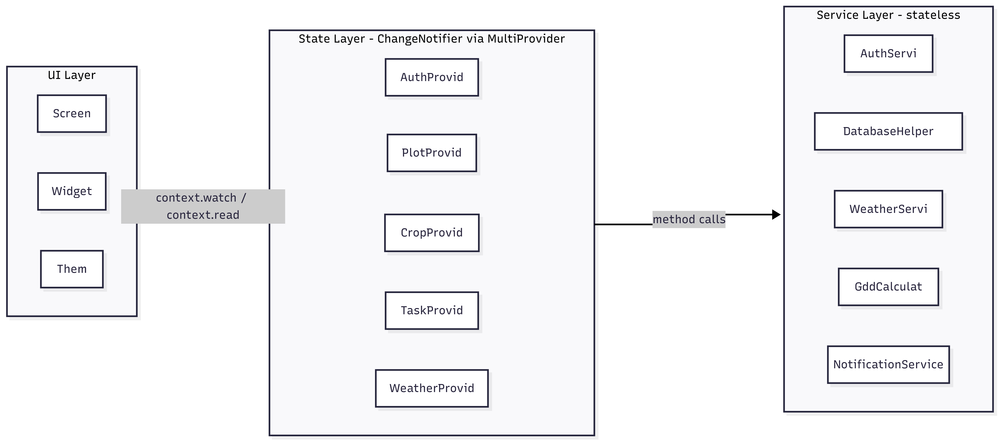
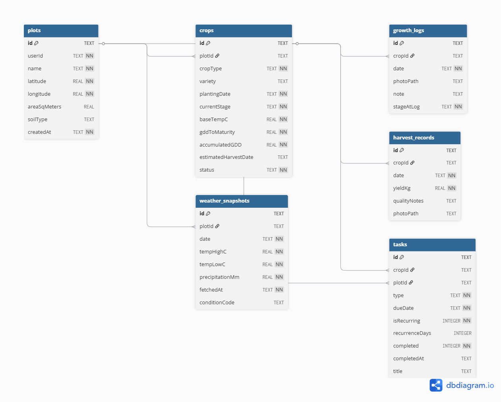
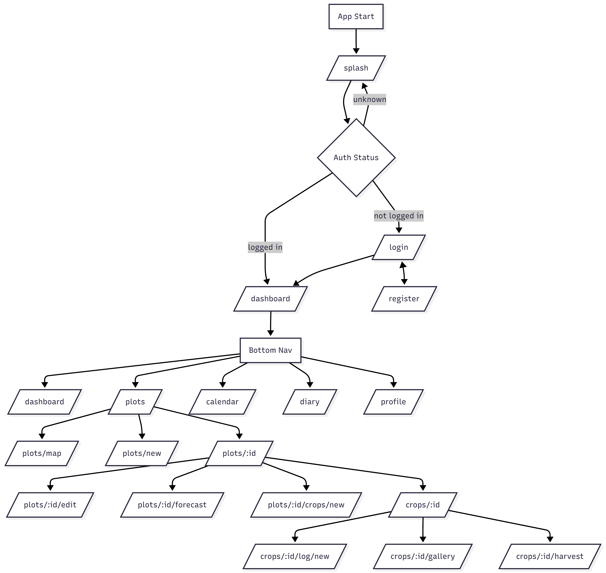

# FarmBuddy

A mobile farm management application built with Flutter that lets farmers track agricultural plots, crops, and growth cycles from seeding to harvest.

---

# FarmBuddy — Technical Documentation

**Course:** Mobile Information Systems  
**Platform:** Flutter (Android / iOS)  

---

## Table of contents

1. [Application overview](#1-application-overview)
2. [Target users and requirements](#2-target-users-and-requirements)
3. [Features](#3-features)
4. [Screens — 17 total](#4-screens)
5. [Architecture](#5-architecture)
6. [Design patterns](#6-design-patterns)
7. [Database schema](#7-database-schema)
8. [Navigation flow](#8-navigation-flow)
9. [Criteria](#9-Critera)
10. [Dependencies](#10-dependencies)
11. [Limitations and future improvements](#11-limitations-and-future-improvements)

---

## 1. Application overview

FarmBuddy is a mobile application for managing farm plots and crops. The idea came from the fact that most farmers, especially beginners, don't have an easy way to keep track of what they planted, when they planted it, and how it's progressing. The app tries to solve that by putting everything in one place — plots, crops, photos, tasks, and weather.

The app stores all data locally on the device using SQLite so it works without internet. When internet is available it fetches weather data from OpenWeatherMap and uses it to calculate something called Growing Degree Days (GDD), which is the innovation feature — it predicts when a crop will be ready for harvest based on real temperature data instead of just guessing.

Main things the user can do:
- Create an account and log in (Firebase)
- Add farm plots with a location (GPS, manual, or map tap)
- Add crops to each plot and track their growth stage
- Take photos and write notes for each crop over time
- Set tasks like watering or fertilizing with reminders
- See a 5-day weather forecast per plot
- See a photo diary of all crops in one place

---

## 2. Target users and requirements

**Who is it for:**  
The app is aimed at individual farmers and beginners who want to start tracking their crops but don't know where to start. It's designed to be simple enough that someone with no farming software experience can use it.

**What it needs to do (functional requirements):**
- Let users register and log in, and stay logged in between app restarts
- Let users add, edit and delete plots and crops
- Support taking photos with the camera or uploading from the gallery, including old photos
- Allow scheduling tasks with repeat options and send a notification reminder
- Show current weather and a 5-day forecast for each plot
- Calculate GDD and estimate harvest date

**Non-functional requirements:**
- Should work offline for the main features
- Should not require any paid APIs (so no Google Maps billing)
- Permissions should be asked from the user at runtime, not assumed

---

## 3. Features

| Feature | What it does |
|---------|-------------|
| Login / Register | Firebase email and password auth |
| Plot management | Add, edit, delete plots. Location via GPS, typed coords, or map tap |
| Map overview | See all plots on one satellite map |
| Crop tracking | Add crops to a plot, growth stage is auto-guessed from planting date |
| Growth logging | Log a photo + note for any date (past or today) |
| Photo gallery | See all growth photos for a crop in order |
| Harvest log | Record how much was harvested and add notes |
| Calendar | See tasks by date, mark done or undo, reschedule |
| Recurring tasks | When you complete a recurring task, the next one is created automatically |
| Notifications | Task reminder at 8:00 AM on the due date |
| Diary | All photos from all crops in one grid, can filter by crop |
| Weather card | Current temperature on the dashboard |
| 5-day forecast | Per plot, shows daily high/low and rain |
| GDD progress | Shows how far along the crop is toward harvest based on temperatures |
| Profile | Toggle units and notifications, log out |

---

## 4. Screens

The app has **17 screens** 

| # | Screen | Route |
|---|--------|-------|
| 1 | Splash | `/splash` |
| 2 | Login | `/login` |
| 3 | Register | `/register` |
| 4 | Dashboard | `/dashboard` |
| 5 | Plot list | `/plots` |
| 6 | Map overview | `/plots/map` |
| 7 | Plot detail | `/plots/:id` |
| 8 | Add / Edit plot | `/plots/new`, `/plots/:id/edit` |
| 9 | Weather forecast | `/plots/:id/forecast` |
| 10 | Add crop | `/plots/:id/crops/new` |
| 11 | Crop detail | `/crops/:id` |
| 12 | Add growth log | `/crops/:id/log/new` |
| 13 | Photo gallery | `/crops/:id/gallery` |
| 14 | Harvest log | `/crops/:id/harvest` |
| 15 | Calendar | `/calendar` |
| 16 | Diary | `/diary` |
| 17 | Profile | `/profile` |

---

## 5. Architecture

I structured the app in 3 layers so that each part has a clear job and doesn't mix with the others:




- **Services** are stateless — they just do one thing (talk to Firebase, talk to SQLite, call the weather API) and return a result
- **Providers** hold the data in memory and notify the UI when something changes
- **Screens** just display data and call provider methods when the user does something

For reading state in the UI I use `context.watch<T>()` inside `build()` so the screen rebuilds when data changes. For writing (like saving a new plot) I use `context.read<T>()` inside button callbacks so it doesn't trigger unnecessary rebuilds.

---

## 6. Design patterns

| Pattern | Where and why |
|---------|--------------|
| **Singleton** | `DatabaseHelper.instance` and `NotificationService.instance` — only one instance of these should ever exist in the app |
| **Observer** | The whole provider setup — screens "observe" providers and rebuild when `notifyListeners()` is called |
| **Repository** | Each provider hides the database calls from the UI. The screen just calls `plotProvider.addPlot(...)` and doesn't know or care about SQL |
| **Factory** | Every model has a `fromMap()` constructor to turn a database row back into a Dart object |
| **Middleware / Guard** | The GoRouter `redirect` function checks authentication on every navigation and blocks unauthenticated access |
| **Value Object** | Models like `Plot` and `Crop` don't change in place — instead `copyWith()` creates a new version with the updated fields |
| **Strategy** | For crop progress, the app uses GDD data if it has it, and falls back to a simpler day-count estimate if not |

---

## 7. Database schema

All data is stored locally in a single SQLite file called `farmbuddy.db`.




- `tasks` can be linked to either a crop or a whole plot (both foreign keys are optional) so you can create a task like "water this crop" or "check the whole plot".
- `weather_snapshots` saves the forecast data so the app doesn't call the API every time. It checks if there's already data for today before 
---

## 8. Navigation flow

Navigation is done with `go_router`. I chose this over plain Navigator because it lets you define all routes in one place and the auth guard is much cleaner — just one `redirect` function instead of wrapping every screen.




## 9. Criterias

### State management 

I used the `provider` package with 5 separate `ChangeNotifier` classes:

| Provider | What it manages |
|----------|----------------|
| `AuthProvider` | Login state, current user, errors, the 5-second timeout |
| `PlotProvider` | List of plots in memory, SQLite read/write |
| `CropProvider` | Crops, growth logs, harvest records, GDD update |
| `TaskProvider` | Tasks, marking done/undone, creating recurring follow-ups |
| `WeatherProvider` | Weather fetch, caching to SQLite |


---

### Authentication 

Firebase Authentication with email and password. The `AuthService` class is just a thin wrapper with three methods: sign in, register, sign out. 

`AuthProvider` listens to `authStateChanges()` which is a stream that runs every time the user logs in or out. 


---

### Custom UI elements 

I built several custom widgets instead of using default Flutter ones:

**`GrowthStageTimeline`** — this is the main custom widget on the crop detail screen. It shows the 6 growth stages (seed → germination → vegetative → flowering → fruiting → harvested) as dots connected by a line, plus a gold progress bar underneath for the GDD percentage.

**`CameraCaptureOverlay`** — a full screen camera view with a custom shutter button and a guide frame in the middle. 

**`PlotCard` and `CropCard`** — custom cards with the earthy color palette (dark green, brown, gold). `CropCard` has a small progress bar built into it.

**`TaskTile`** — custom task row with a circular checkbox that turns green when done, and a red border if the task is overdue.

---

### Web services 

I used the `http` package to call the OpenWeatherMap API which is free to use.

Two endpoints are used:
1. `/data/2.5/weather` — for the current conditions card on the dashboard
2. `/data/2.5/forecast` — for the 5-day forecast screen and GDD calculation


To avoid calling the API too much, the results are saved to the `weather_snapshots` SQLite table. 
Before making a request, the app checks if there's already data for today's date for that plot.

---

### Location services 

I used `geolocator` for getting the GPS coordinates and `flutter_map` for showing maps. 

The plot creation screen gives 3 ways to set a location:
1. Tap "Use my current location" — uses GPS
2. Type in latitude and longitude manually (Will need to get the coordinates from Google Maps)
3. Open the map and find you plot

This allows farmers to add plots even if they are not physically there

---

### Camera services 

I used the `camera` package for the custom camera overlay and `image_picker` for choosing from the gallery.

The growth log screen lets you either take a new photo or pick an existing one from the gallery. You can also set any past date for the log entry. If someone forgot to take a photo at the right time, they should still be able to log it with an old photo and set the date correctly.

Photo paths are saved as strings in the `growth_logs` table. `Image.file(File(path))` loads them when displayed. Photos stay in the device's local storage.

---

### Data handling 

The main database is SQLite via the `sqflite` package. I chose SQLite because the data is relational (plots have many crops, crops have many logs, etc.)

The `DatabaseHelper` class is a singleton that handles all database operations. I wrote three generic helper methods — `insert`, `update`, `delete` — that all providers use instead of writing raw SQL everywhere. There's also `queryAll` with optional where/orderBy parameters.

IDs are generated with the `uuid` package on the client side. 

---

### Navigation 

`go_router` with 17 named routes. All routes are in one file (`app_router.dart`) which makes it easy to see the whole navigation structure at once.

The `StatefulShellRoute.indexedStack` handles the bottom navigation. Each of the 5 tabs keeps its own navigation stack alive in memory so switching tabs doesn't lose your place.

The auth guard is a `redirect` callback on the router. Every time any navigation happens it checks `authProvider.status` and redirects if needed.

---

### More than 7 screens 

17 screens total. 

---

### Innovation aspect 

The innovation feature is a Growing Degree Days (GDD) calculator. I learned about this while researching how farmers actually predict harvest time, and it turns out professional agriculture uses temperature accumulation rather than just counting days. The basic idea is:

```
GDD for one day = max(0, average_temperature_that_day − crop_base_temperature)
```

Each crop has a base temperature (the minimum temperature it grows at) and a total GDD it needs to reach maturity. By adding up GDD every day since planting and comparing to the target, you can say "this crop is 67% of the way to harvest."

In the app it works like this:
1. The crop model stores `baseTempC` and `gddToMaturity` which I looked up for each crop type (tomato, watermelon, pepper, etc.)
2. When you refresh weather on the crop screen, it fetches the forecast and saves it to SQLite
3. `GddCalculator.accumulate()` sums up the GDD from all saved weather rows
4. The result updates the progress bar and estimated harvest date on the screen
5. If there's no weather data yet, it falls back to a simpler calculation based on days since planting

---


## 10. Dependencies

```yaml
provider: ^6.1.2          #
go_router: ^14.2.0        # navigation state management
firebase_core: ^3.3.0     # Firebase setup
firebase_auth: ^5.1.4     # authentication
sqflite: ^2.3.3+1         # local database
path: ^1.9.0              # file paths for SQLite
shared_preferences: ^2.2.3 # settings storage
http: ^1.2.2              # API calls
geolocator: ^13.0.1       # GPS
flutter_map: ^7.0.2       # map display
latlong2: ^0.9.1          # coordinates
camera: ^0.11.0+2         # camera capture
image_picker: ^1.1.2      # gallery access
path_provider: ^2.1.4     # device file paths
flutter_local_notifications: ^17.2.2  # task reminders
timezone: ^0.9.4          # required by notifications
intl: ^0.19.0             # date formatting
uuid: ^4.4.2              # generating unique IDs
```

---

## 11. Limitations and future improvements

There are several things I would improve if I had more time or if this app were to be developed further:

**GDD only uses forecast data** — the free OpenWeatherMap tier doesn't give historical weather data, so GDD can only accumulate going forward from when the user first fetches weather. A better version would automatically save one weather record per day in the background so it builds up over time.

**Data only lives on one device** — everything is in local SQLite. If you change phones or want to access your data from a tablet, there's no way to do that. Adding Firebase Firestore sync would solve this but was out of scope for this project. 

**Notifications don't survive reinstall** — if the app is uninstalled and reinstalled, all scheduled notifications are gone. The app would need to reschedule them on startup by reading the task list.

**Crop icons are placeholders** — the crop cards use generic Material icons because creating custom icons for each crop type would have taken too long. This is something that would make the UI much better visually.

**AI disease detection** -  A future version could analyze crop photos using a machine learning model (TensorFlow Lite on-device or Plant.id API) to automatically detect diseases or nutrient deficiencies from growth log photos. This would make the app significantly more useful for beginner farmers who don't know what a sick plant looks like.

## Setup

## Prerequisites

- Flutter SDK ≥ 3.3.0
- Android Studio (for Android SDK tools, even if using VS Code as editor)
- A Firebase project with Email/Password authentication enabled
- A free OpenWeatherMap API key — https://openweathermap.org/api

---

## Setup

### 1. Generate platform folders

```bash
flutter create . --org com.example --project-name farmbuddy --platforms=android,ios
flutter pub get
```

Skip / say "no" if asked about overwriting existing files — it only fills in the missing `android/` and `ios/` folders.

### 2. Firebase

```bash
dart pub global activate flutterfire_cli
flutterfire configure
```

This generates `lib/firebase_options.dart`. Enable **Email/Password** under Authentication → Sign-in method in the Firebase console.

### 3. Android permissions

In `android/app/src/main/AndroidManifest.xml`, inside `<manifest>` above `<application>`:

```xml
<uses-permission android:name="android.permission.INTERNET"/>
<uses-permission android:name="android.permission.ACCESS_FINE_LOCATION"/>
<uses-permission android:name="android.permission.ACCESS_COARSE_LOCATION"/>
<uses-permission android:name="android.permission.CAMERA"/>
<uses-permission android:name="android.permission.SCHEDULE_EXACT_ALARM"/>
```

In `android/app/build.gradle.kts`:

```kotlin
compileOptions {
    sourceCompatibility = JavaVersion.VERSION_17
    targetCompatibility = JavaVersion.VERSION_17
    isCoreLibraryDesugaringEnabled = true
}
dependencies {
    coreLibraryDesugaring("com.android.tools:desugar_jdk_libs:2.1.5")
}
```

### 4. iOS permissions

In `ios/Runner/Info.plist` inside the outer `<dict>`:

```xml
<key>NSLocationWhenInUseUsageDescription</key>
<string>FarmBuddy uses your location to pin new plots on the map.</string>
<key>NSCameraUsageDescription</key>
<string>FarmBuddy uses the camera to log crop growth photos.</string>
<key>NSPhotoLibraryUsageDescription</key>
<string>FarmBuddy needs photo library access to attach existing photos.</string>
```

---

## Running

```bash
# With weather API key:
flutter run --dart-define=OWM_API_KEY=your_key_here

# Or hardcode the key in lib/services/weather_service.dart for development 
flutter run
```

---

## Reset database

Uninstall the app from the device to wipe all local data:

```bash
adb uninstall com.example.farmbuddy
```

---

